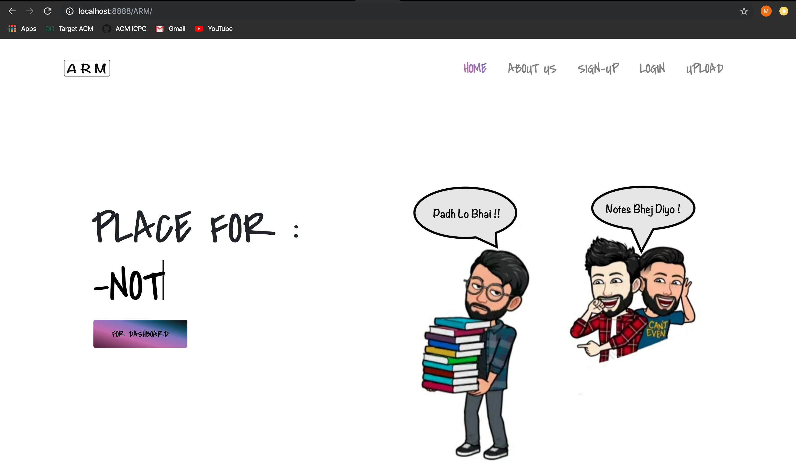
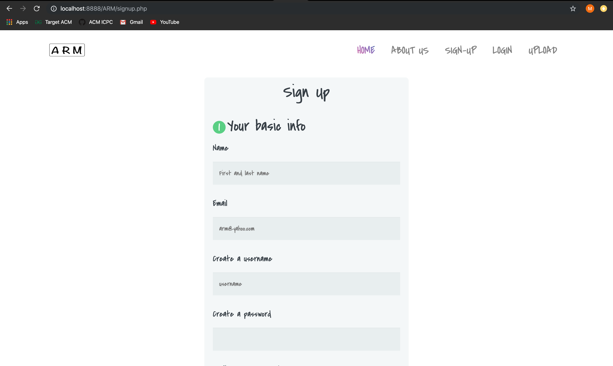
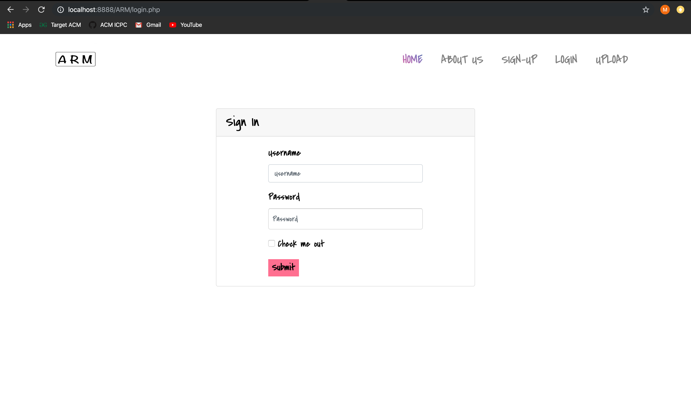
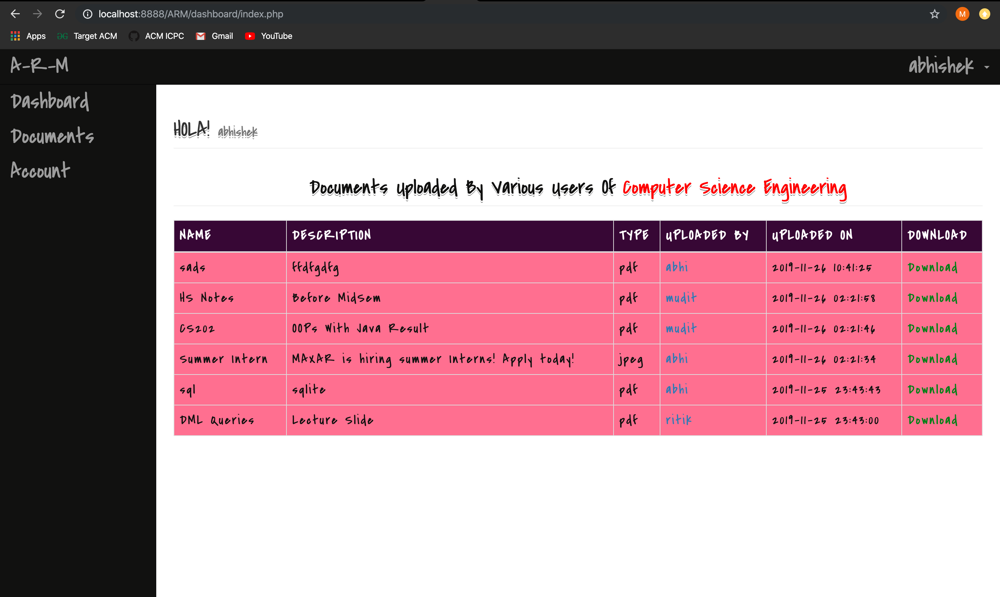
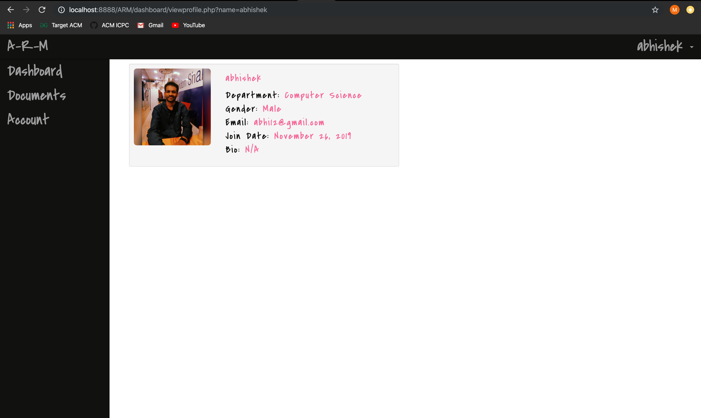
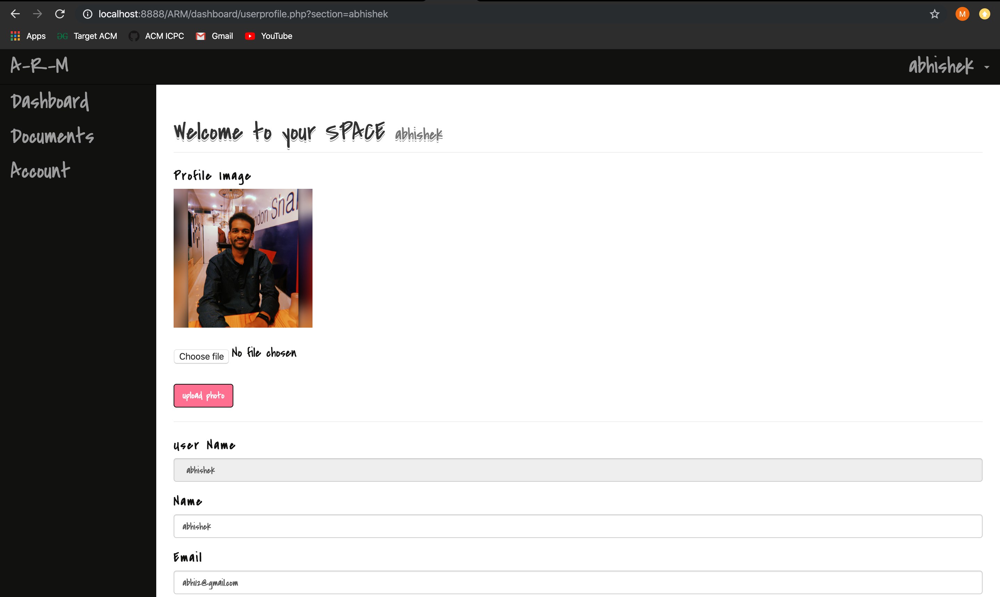
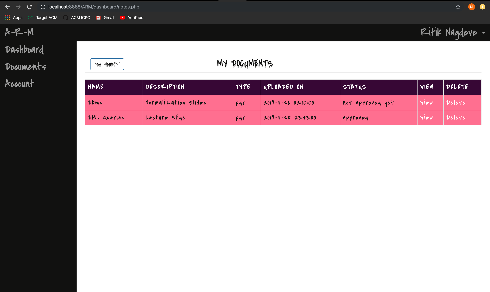
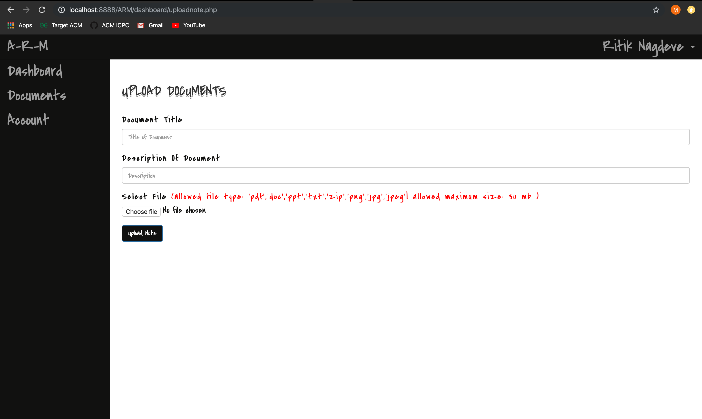
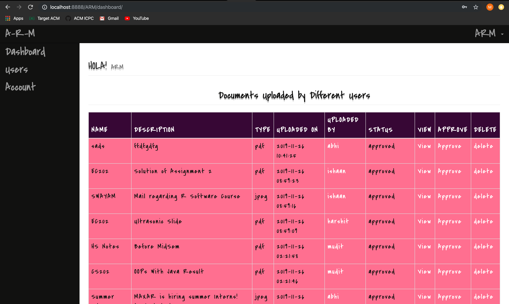
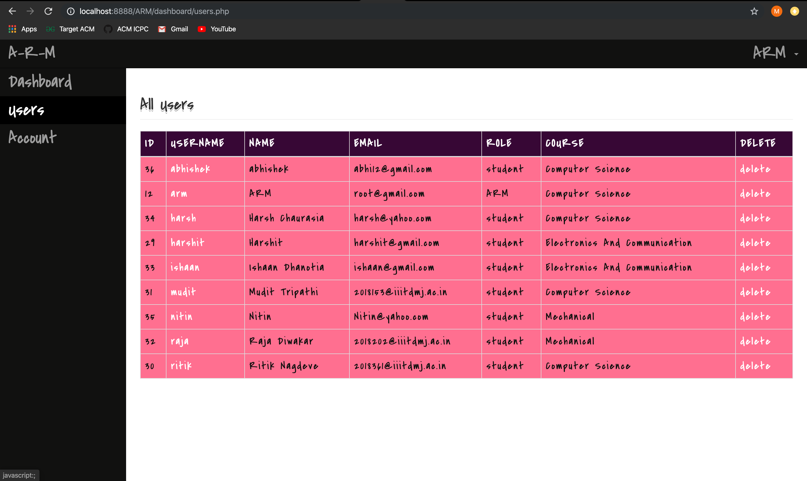

# A R M
Basically, ARM stands for Abhishek, Ritik and Mudit, The People behind this Awesome Project!

ARM is a place for users, to upload,download and manage important documents like Notes,Tutorials,Scholarships and Internship details for a particular discipline. Not only this, By keeping Security and Privacy in Mind, We also made an ADMIN named `ARM` to look after the documents, that were being uploaded by various students!  

## INSTALLATION :


* LINUX 

  * Install LAMP Server
  * Clone the repository: `git clone https://github.com/abhisheknaiidu/A-R-M.git`
  * Copy ARM folder to `/var/www/html/`
  * Open Browser and navigate to `http://localhost/ARM/`

* MAC 

  * Install MAMP Server
  * Navigate to Applications/MAMP/htdocs/
  * Clone the repository: `git clone https://github.com/abhisheknaiidu/A-R-M.git`
  * Start MAMP Server
  * Open Browser and navigate to `http://localhost/ARM/`

* WINDOWS

  * Install WAMP Server
  * Navigate to the directory `/wamp/www`
  * Clone the repository: `git clone https://github.com/abhisheknaiidu/A-R-M.git`
  * Start the WAMP Server
  * Open Browser and navigate to `http://localhost/ARM/`


## SCREENSHOTS :


```diff
+ PORTAL'S HOME PAGE :

```




```diff
+ SIGN-UP PAGE :

```


```diff
+ LOGIN PAGE :

```



```diff
+ USER'S HOME PAGE :

```



```diff 
+ PROFILE PAGE :

```



```diff
+ EDIT PROFILE PAGE :

```


```diff
+ MY DOCUMENTS PAGE - List of Various Documents Posted By Respective User in the Portal. 

```


```diff
+ UPLOADING PAGE - For Uploading Documents Page.

```


```diff
#AFTER UPLOADING, ARM, The Admin of the Portal Has To give approval to the particular document to get it published in the Portal. 

+ ARM's HOME PAGE :
```


```diff
+ USER'S PAGE : ARM Can DELETE any USER!

```



